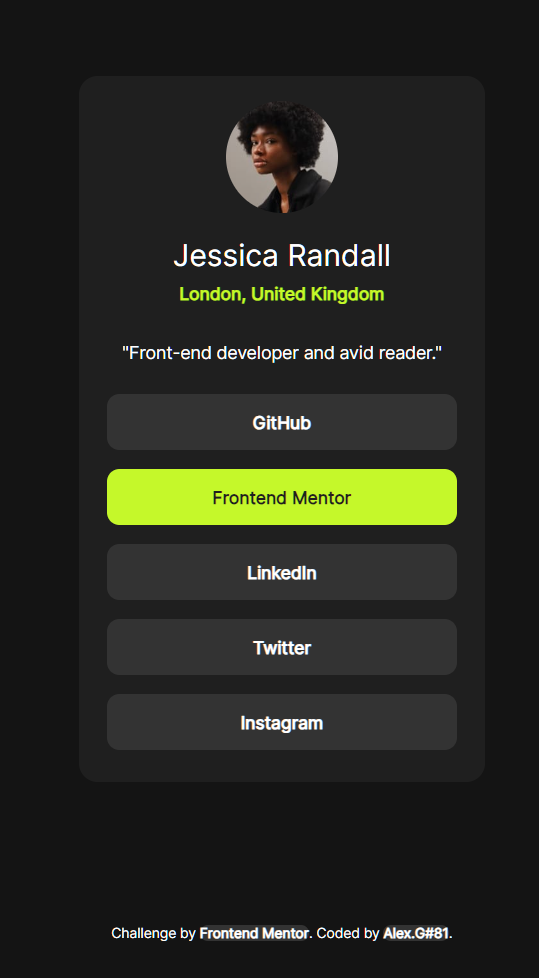

# Frontend Mentor - Social links profile

## Welcome! 👋

Thanks for checking out this front-end coding challenge.

[Frontend Mentor](https://www.frontendmentor.io) challenges help you improve your coding skills by building realistic projects.

## The challenge

Your challenge is to build out this social links profile and get it looking as close to the design as possible.

Your users should be able to:

- See hover and focus states for all interactive elements on the page

Want some support on the challenge? [Join our community](https://www.frontendmentor.io/community) and ask questions in the **#help** channel.
